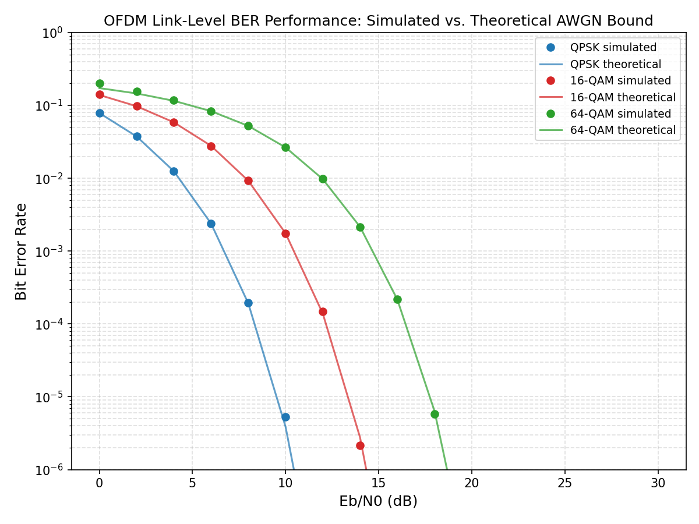

<<<<<<< HEAD
# OFDM Link-Level Simulator (Modern C++)

A modular, class-based OFDM link-level simulator: bits → QAM mapping →
OFDM modulation (IFFT + cyclic prefix) → AWGN channel → OFDM demodulation
(FFT) → QAM demapping → BER/BLER analysis. Validated against the closed-form
theoretical AWGN bit-error-rate bound for QPSK, 16-QAM, and 64-QAM.



Simulated BER (markers) matches the theoretical Gray-coded square-QAM AWGN
bound (lines) to within Monte Carlo noise across all three modulation
orders, confirming the mapper, IFFT/FFT chain, CP handling, and noise model
are all implemented correctly end-to-end.

## Architecture

Each pipeline stage is an independent, unit-tested class with a narrow
interface (`std::vector<...>` in, `std::vector<...>` out):

```
BitSource → QamModulator::map → OfdmModulator::modulate (subcarrier map,
IFFT, +CP) → Channel::addAwgn → OfdmModulator::demodulate (-CP, FFT,
extract subcarriers) → QamModulator::demap → BER comparison
```

`LinkSimulator` is the orchestration layer -- it owns no DSP logic itself,
only sequencing and Monte Carlo accumulation over an SNR sweep.

```
include/
  SystemConfig.hpp     - single source of truth for all numeric parameters
  BitSource.hpp         - i.i.d. random bit generator
  QamModulator.hpp      - Gray-coded square-QAM map/demap (QPSK/16/64-QAM)
  OfdmModulator.hpp     - subcarrier mapping, IFFT/FFT, CP insert/remove
  Channel.hpp            - AWGN channel
  BerAnalyzer.hpp       - closed-form theoretical BER (validation reference)
  LinkSimulator.hpp     - pipeline orchestration + Monte Carlo sweep
src/
  LinkSimulator.cpp
  main.cpp              - single-modulation run (config in SystemConfig)
  main_all_mod.cpp      - QPSK/16-QAM/64-QAM comparison sweep
tests/
  test_qam.cpp           - map/demap round-trip, energy normalization
  test_ofdm.cpp           - IFFT/FFT round-trip, CP correctness, Parseval check
  test_pipeline.cpp     - full-chain loopback, BER-vs-theory validation
scripts/
  plot_ber.py           - generates results/ber_curve.png from the CSVs
external/kissfft_header - vendored kissfft.hh (single-header, BSD-3-Clause)
```

## Building and running

Requires CMake >= 3.16 and a C++17 compiler. Catch2 and the test harness are
fetched automatically via CMake FetchContent (needs network access on
first configure).

```bash
mkdir build && cd build
cmake .. -DCMAKE_BUILD_TYPE=Release
cmake --build . -j4

./nr_phy_tests            # unit tests (207 assertions)
./nr_phy_sim               # single-modulation BER sweep -> results/ber_results.csv
./nr_phy_sim_all_mod       # QPSK/16/64-QAM sweep -> results/ber_results_bps{2,4,6}.csv

cd .. && python3 scripts/plot_ber.py   # -> results/ber_curve.png
```

## Design decisions and documented simplifications

Being explicit about what's modeled vs. simplified is deliberate -- these
are exactly the points worth being able to discuss in an interview.

- **Unitary FFT/IFFT scaling (1/√N both directions).** Chosen so QAM
  symbol energy is preserved exactly through the transform (Parseval),
  which makes the Eb/N0 → noise-variance conversion in `Channel`
  straightforward and keeps the simulated curve directly comparable to
  the closed-form bound. Verified explicitly in
  `test_ofdm.cpp::"Energy is preserved..."`.

- **AWGN added in the time domain, at the sample level, not the symbol
  level.** This matches how noise actually enters a receiver (at the
  ADC/front-end, before CP removal and FFT) rather than being injected
  synthetically per-subcarrier. Because the transform is unitary, this is
  provably equivalent to per-subcarrier noise of the same variance --
  documented in `Channel.hpp`.

- **Noise model does not penalize for CP transmit-energy overhead.**
  A real transmitter pays a small SNR penalty (~`cpLen/(fftSize+cpLen)`
  in dB, ≈0.97 dB at cpLen=16/fftSize=64) because the CP retransmits
  energy without carrying new information. This simulator reports
  `SystemConfig::cpOverheadFraction()` separately as a spectral-efficiency
  metric rather than folding it into the noise variance -- a deliberate
  scope decision, not an oversight, and worth stating that way if asked.

- **Generic Gray-coded square-QAM, not the literal 3GPP TS 38.211 bit-to-
  symbol table.** Functionally equivalent for BER/BLER analysis (same
  constellation, same Gray labeling structure), but not byte-identical to
  the specific table 3GPP defines for hardware/interleaving reasons.
  Swapping in the exact 38.211 mapping is a natural, scoped extension.

- **No channel estimation / equalization yet** -- the AWGN channel has
  unit gain, so there's nothing to equalize. This is the natural next
  phase: add a multipath fading channel (tapped-delay line / CDL model),
  DMRS pilot insertion, and MMSE channel estimation + equalization.

- **Theoretical BER formula is a nearest-neighbor approximation.** It is
  exact for QPSK but slightly loose for 16/64-QAM at low SNR (visible in
  the 64-QAM curve at 0 dB: simulated 0.200 vs. theoretical 0.173) because
  it undercounts higher-order neighbor error contributions. The two
  converge tightly by ~14-16 dB, exactly as expected -- this gap is a
  known property of the reference formula, not a simulator bug.

## Suggested next phases

1. **Multipath fading channel** (CDL-A/B tapped-delay line) + DMRS pilot
   insertion + LS/MMSE channel estimation + ZF/MMSE equalization --
   biggest single credibility jump for "realistic" 5G NR PHY.
2. **Synchronization**: timing/frequency offset estimation via
   correlation-based detection.
3. **Channel coding** (rate-1/2 convolutional or LDPC) for BLER (not just
   uncoded BER) analysis.
4. **PAPR analysis** of the transmitted waveform -- easy extension, useful
   talking point for hybrid-beamforming-adjacent roles.
5. **Multithreaded Monte Carlo** -- parallelize the per-trial loop in
   `LinkSimulator::runBerSweep` across SNR points with a thread pool;
   directly relevant since this is where real link-level simulators spend
   their compute budget.
=======
# OFDM-simulator-in-C-
>>>>>>> 8c6d06781d6f8c592f66af9901f0f4de2efdd4bd
